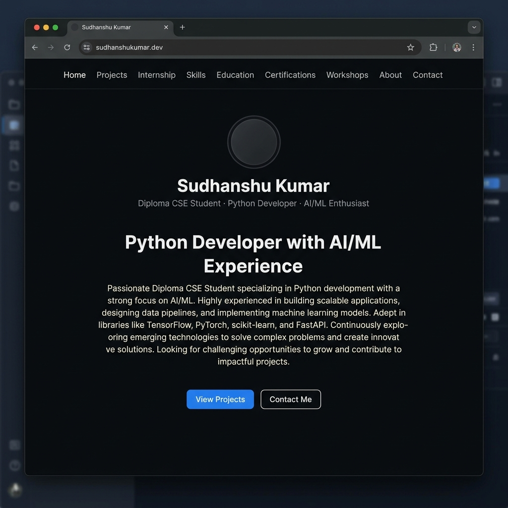
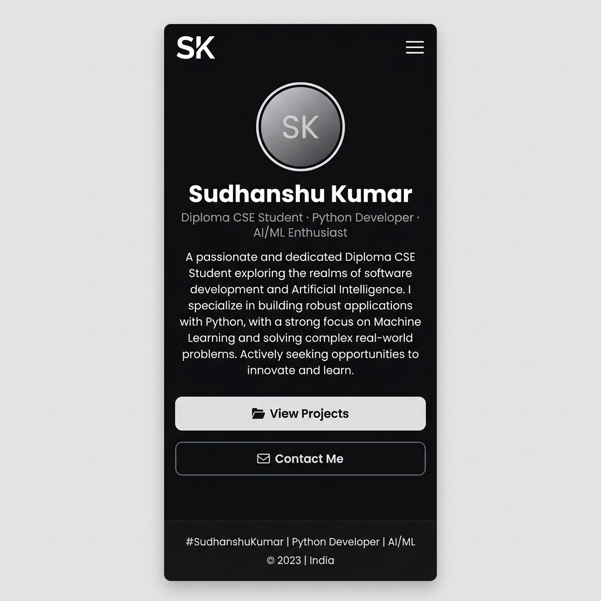

# Sudhanshu Kumar — Portfolio

A responsive personal portfolio website built to showcase my projects, technical skills, internship experience, certifications, and workshops.

## 🔗 Live Demo

**[https://portfolio-aflw.vercel.app](https://portfolio-aflw.vercel.app)**

## 🛠️ Tech Stack

| Technology | Purpose |
|---|---|
| React | Component-based UI |
| TypeScript | Type-safe development |
| Vite | Fast build tool & dev server |
| CSS | Styling & responsive design |
| Vercel | Deployment & hosting |

## 📋 Sections

- **About Me** — Background, interests, and goals
- **Projects** — AI-Powered Attendance System, AI Resume ATS System
- **Internship** — Marketing & Operations Intern (Team Lead) at PhysicsWallah
- **Technical Skills** — Python, C, HTML, CSS, and more
- **Education** — Diploma in CSE from Lovely Professional University
- **Certifications** — Oracle, Udemy, Be10x, Apna College, LPU
- **Workshops** — Data Analytics by 07 Solutions
- **Contact** — Email, GitHub, LinkedIn

## 🚀 Run Locally

```bash
git clone https://github.com/sudhanshukumar142/portfolio.git
cd portfolio
npm install
npm run dev
```

The development server will start at `http://localhost:5173`.

## 📸 Screenshots

| Desktop View | Mobile View |
|---|---|
|  |  |

## ✨ Key Features

- Fully responsive design (mobile, tablet, desktop)
- Dark theme with modern UI components
- Smooth scroll navigation
- Detailed project showcases with GitHub links
- Internship experience with responsibilities
- Certification and workshop listings

## 📬 Contact

- **Email:** sudhanshuyadav914243@gmail.com
- **LinkedIn:** [linkedin.com/in/sudhanshu-kumar8](https://linkedin.com/in/sudhanshu-kumar8)
- **GitHub:** [github.com/Sudhanshukumar142](https://github.com/Sudhanshukumar142)

---

*Built with ❤️ by Sudhanshu Kumar*
